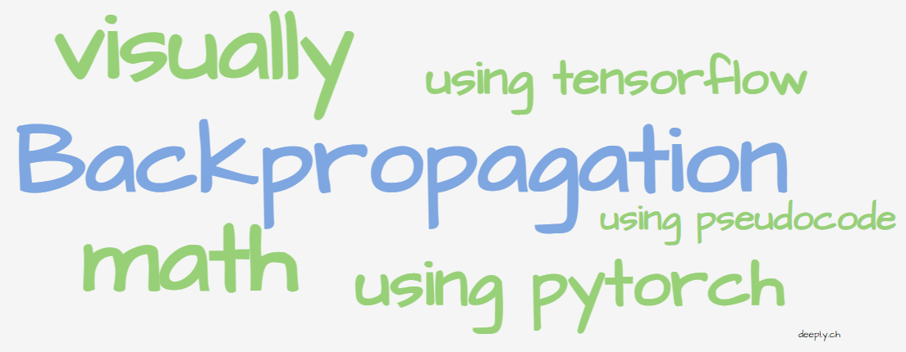
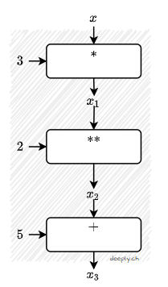
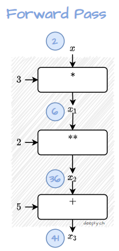
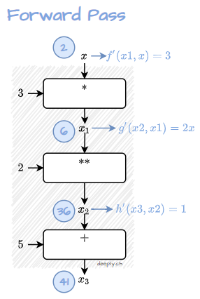
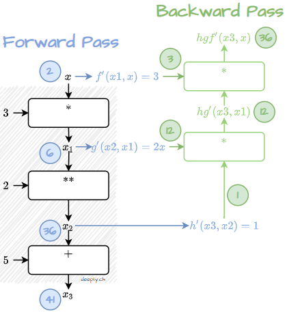

A typical *deep learning model* consists of many layers, each containing many adjustable parameters (also called *weights*). From the deep learning perspective *predictions* are nothing more than a sequence of data transformations. During the training phase each data transformation (or to be more precise its weights) are tuned to make more accurate predictions. 

**The question is how to tune these weights and by how much?** This question remained for a long time unanswered until Rumelhart, Hinton & Williams made a revolutionary breakthrough with the *Backpropagation algorithm*.

Simply put, backpropagation allows efficient computation of prediction contribution for each individual weight. Without knowing who contributes and how much it is nearly impossible to adjust weights. In other words, it is almost impossible to *learn* how to make better predictions and learn anything.

At its core, the backpropagation follows following steps:
1. take data input calculate forward through the layers (Note: typically, the last layer is special, because it calculates the error, see *how to learn from data*),
2. on the way down in the computational graph calculate derivatives for each operation, then
3. run from the end of the graph up and calculate individual weight contribution using derivatives and forward pass results (*backward pass*).

Sometimes the best way to learn is to see and follow examples. To make it stick, we go a bit further and provide several perspectives for the same example by: 
* introducing step-by-step visualization,
* implementing it in pseudocode, then
* implementing concisely using `PyTorch` and `TensorFlow` deep learning frameworks, and last but not least, 
* providing mathematical symbolic notation for all the steps above.

Key ideas behind the backpropagation algorithm: 
### Backpropagation visualized









### Backpropagation using pseudocode

```python
# define individual functions
def f(x):
    return 3*x

def g(x):
    return x**2

def h(x):
    return x+5
```

```python
# define composite function
def hgf(x):
    x1 = f(x)
    x2 = g(x1)
    x3 = h(x2)
    return x3
```

```python
# define derivatives for each individual function
def grad_f(x):
    return 3

def grad_g(x):
    return 2*x

def grad_h(x):
    return 1
```

```python
# define derivatives for the compsite function
def grad_hgf(x):
    x1 = f(x)
    x2 = g(x1)
    return grad_h(x2)*grad_g(x1)*grad_f(x)
```


### Backpropagation using Python

```python
# import libraries
import torch

# data
x = torch.tensor(2.0,requires_grad=True)

# forward pass
y = hgf(x)

# backward pass
y.backward()
x.grad 
# tensor(36.)
```

### Backpropagation using TensorFlow

```python
# import libraries
import tensorflow as tf

# data
x = tf.Variable(2.0)

# forward pass
with tf.GradientTape() as tape:
  y = hgf(x)

# backward pass
tape.gradient(y, x) 
# <tf.Tensor: shape=(), dtype=float32, numpy=36.0>
```

### Backpropagation using mathematical notation

Mathematically, the workhorse behind backpropagation is *chain rule*, which is used to compute the derivative of a composite function $h(g(f(x)))$, also often written as $(h \circ g \circ f)(x)$:

$$(h(g(f(x)))'=(h \circ g \circ f)(x)'=h'(g(f(x)))*g'(f(x))*f'(x)$$

Consider $h(g(f(x)))=(3x)^2+5$, which can be decomposed as:

$$f(x) = 3x$$

$$g(x)=x^2$$

$$h(x)=x+5$$

and their derivatives:

$$f'(x) = 3$$

$$g'(x)=2x$$

$$h'(x)=1$$

Applying the chain rule yields:

$$h(g(f(x)))'=1*6x*3=18x$$ 

Since in our example $x=2$:

$$h(g(f(2)))'=1*6x*3=18*x=36$$ 

## What is next?
Actually, backpropagation refers only to the method for computing individual weight contributions (*gradients* mathematically). 

Further algorithms are needed to perform the actual weight adjustments. Among the most prominent are: *Stochastic Gradient Descent*, *Momentum*, *Adagrad* and *RMSProp*

### References
[Rumelhart, David E., Geoffrey E. Hinton, and Ronald J. Williams. "Learning representations by back-propagating errors." nature 323.6088 (1986): 533-536.](http://www.cs.toronto.edu/~hinton/absps/naturebp.pdf)

[Deep Learning, 2016. Ian Goodfellow, Yoshua Bengio, Aaron Courville. The reference book for deep learning models: 197-214](https://www.deeplearningbook.org/)

[]
[Autograd Mechanics in PyTorch](https://pytorch.org/docs/stable/notes/autograd.html)

[TensorFlow Differentiation](https://www.tensorflow.org/guide/advanced_autodiff)