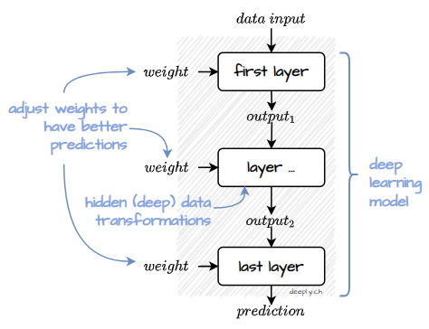
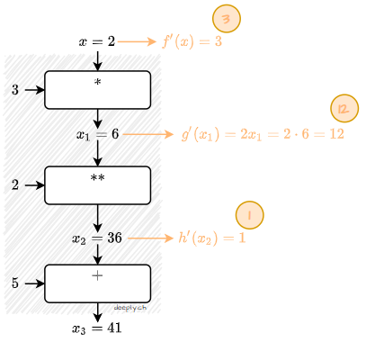
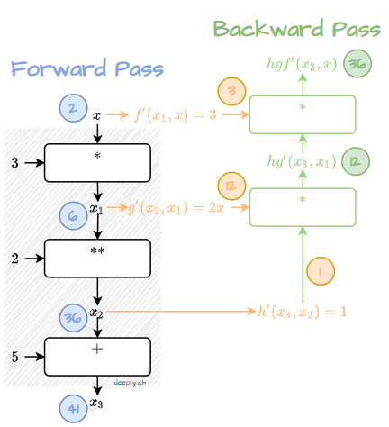

> “I have no special talents. I am only passionately curious.”
― Albert Einstein

*Backpropagation* is of the key ingredients of almost any deep learning framework. Simply put, backpropagation allows to extract insights about the scale of contribution of each individual part of the model. What are the different parts? 

A typical *deep learning model* can be broken down into many layers, each performing some operation and containing many adjustable parameters (also called *weights*) to tune these operations. Weights are tuned during *training* to make the predictions matching the expected results. 



**But how to tune these weights and by how much?** This question remained for a long time unanswered until Rumelhart, Hinton & Williams made a revolutionary breakthrough with the *Backpropagation algorithm*.


At its core, backpropagation algorithm consists of following three steps:
1. take data input and calculate forward through the layers (Note: typically, the last layer is special as it calculates the error, see *how to learn from data*),
2. on the way down in the computational graph calculate rate of change (*gradients*) for each operation, then
3. run from the end of the graph up and calculate individual weight contribution using forward pass results (*backward pass*).

Sounds a bit more complicated than it is. To make the backpropagation algorithm stick, we consider an example from a few perspectives: 
* first, by introducing step-by-step visualization, then
* implementing it in pseudocode, 
* implementing concise versions using `PyTorch` and `TensorFlow` deep learning frameworks, and last but not least, 
* providing mathematical symbolic notation for all the steps above.
### Backpropagation visualized


Let's start with a very simple data transformation $(3\cdot x)^2+5$ where the consecutive transformation of input $x$ can be visualized as a series of data transformation steps in a computational graph. The first step is multiplying input: $3\cdot x$, then applying $(..)^2$, and adding $5$ to the final result.


To see the computational graph in motion, we pick $x=2$ as an example. Passing input through our computational graph yields $41$. Simple? It is.


But before we move on, there is some additional work to do. Note: depending on the implementation this additional step can be done later during the *backpropagation* phase. But here, we do it right now.

So what is the additional step all about? For every data data input we want to save information how it affects the outcome of next operation. It is much simpler than it sounds. 

Let's take an example: if the data operation is $3x$, where $x$ is the input, then for every unit $x=1$ the change is: $3\cdot 1=3$. We keep this as additional information in our graph and move to the next step. The rate of change for $x^2$ is $2\cdot x$ and for the last step $x+5$ it is just $1$. By the way, these operations have a name: *rate of change* or *gradient* if you are a mathematician.


Now, after being done with the *forward phase*, we run so called *backward pass* where all our previous efforts are starting bearing fruits. We begin backward pass with the last operation's *rate of change* and move up the graph by multiplying all intermediate results from the forward pass. That's it.

### Backpropagation using pseudocode

```python
# define individual functions
def f(x):
    return 3*x

def g(x):
    return x**2

def h(x):
    return x+5
```
We start by defining data transformations as simple functions.
```python
# define composite function
def hgf(x):
    x1 = f(x)
    x2 = g(x1)
    x3 = h(x2)
    return x3
```
Next, we stack individual functions into one function.

```python
# define gradients for each individual function
def grad_f(x):
    return 3

def grad_g(x):
    return 2*x

def grad_h(x):
    return 1
```

Each individual function has a shadow *rate of change* function. 

```python
# define gradient for the compsite function
def grad_hgf(x):
    x1 = f(x)
    x2 = g(x1)
    return grad_h(x2)*grad_g(x1)*grad_f(x)

grad_hgf(2) 
# 36
```
For the composite function, *the rate of change* is the multiplication of *rate of change* functions.


### Backpropagation using PyTorch

`PyTorch` records all *forward pass* information automatically for any data which has `.requires_grad` set to `True`. This can be done by providing `requires_grad=True` during initialization.

Calling `.backward()` method of the predictor trigger the *backward pass*.
```python
# import libraries
import torch

# data
x = torch.tensor(2.0,requires_grad=True)
x.requires_grad # True

# forward pass
y = hgf(x)

# backward pass
y.backward()
x.grad 
# tensor(36.)
```

### Backpropagation using TensorFlow

TensorFlow provides `tf.GradientTape()` to record all required information during the *forward pass*.

To run the *backward pass* use the `gradient(prediction,input)` method of `tf.GradientTape()`.

```python
# import libraries
import tensorflow as tf

# data
x = tf.Variable(2.0)

# forward pass
with tf.GradientTape() as tape:
  y = hgf(x)

# backward pass
tape.gradient(y, x) 
# <tf.Tensor: shape=(), dtype=float32, numpy=36.0>
```
### Backpropagation using mathematical notation

Let's start with a simple case where we have just two functions $g(x)$ and $f(x)$. If applied one after another we have $g(f(x))$. The rule for calculating the gradient is:

$$g(f(x))'=g'(f(x)) \cdot f'(x)$$

If we have three functions applied one after another (as in our example above), the rule is:

$$h(g(f(x)))'=h'(g(f(x))) \cdot g'(f(x)) \cdot f'(x)$$

Four functions applied one after another? Easy:

$$i(h(g(f(x))))'=i'(h(g(f(x)))) \cdot h'(g(f(x))) \cdot g'(f(x)) \cdot f'(x)$$

You see the pattern? Good 👍! That's why it's called *chain rule*. Surprise, surprise. 

Ok, now let's step back to our example with three functions. One further note before we continue. To save ink and make it easier to read $h(g(f(x)))'$ is often written as $(h \circ g \circ f)(x)$:

$$(h \circ g \circ f)'(x)=h'(g(f(x))) \cdot g'(f(x)) \cdot f'(x)$$


Now, continuing with our initial example, consider $(h \circ g \circ f)(x)=(3x)^2+5$, which can be also decomposed as:

$$f(x) = 3x$$

$$g(x)=x^2$$

$$h(x)=x+5$$

and after calculating the respective gradients:

$$f'(x) = 3$$

$$g'(x)=2x$$

$$h'(x)=1$$

Placing intermediate calculations above into $h'(g(f(x))) \cdot g'(f(x)) \cdot f'(x)$ yields:

$$h'(g(f(x)))=1$$

$$g'(f(x))=2 \cdot (3x)$$

$$f'(x)=3$$

or if we put further together:

$$(h \circ g \circ f)(x)'=1 \cdot2 \cdot (3x) \cdot 3=18x$$ 

Finally, placing as input $x=2$ from our initial example yields:

$$(h \circ g \circ f)(2)'=18x=36$$ 

Done. 
## What's next?
Actually, backpropagation refers only to the method for computing individual weight contributions. 

Further algorithms are needed to perform the actual weight adjustments. Among the most prominent are: *Stochastic Gradient Descent*, *Momentum*, *Adagrad* and *RMSProp*.

### References
[Rumelhart, David E., Geoffrey E. Hinton, and Ronald J. Williams. "Learning representations by back-propagating errors." nature 323.6088 (1986): 533-536.](http://www.cs.toronto.edu/~hinton/absps/naturebp.pdf)

[Deep Learning, 2016. Ian Goodfellow, Yoshua Bengio, Aaron Courville. The reference book for deep learning models: 197-214](https://www.deeplearningbook.org/)

[Autograd Mechanics in PyTorch](https://pytorch.org/docs/stable/notes/autograd.html)

[TensorFlow Differentiation](https://www.tensorflow.org/guide/advanced_autodiff)