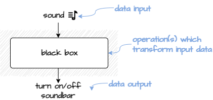
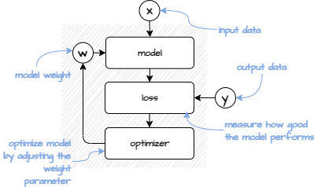

### 10,000 View

What does it mean to learn from data? Simply put, it means to find an algorithm, which would replace a black box below with a set of rules/operations and deliver correct predictions. The whole trick is to let the algorithm to find this set of rules solely from given (input, output) examples. This is where *learning* analogy comes from.



### How to Learn from Data (Naïve Approach)
To understand the mechanics, we start our exploration with some somewhat simplistic data where each row corresponds to an $(input, output)$ pair:


| input  | output |
|--------|--------|
| 4      | 8      |
| 7      | 14     |
| 10     | 20     |

Our **goal** (or task) is to come up with an operation $f$ which would produce correct output from any given input e.g. $f(4)=8$. For this particular example, there is an visible pattern between input and output, which can be expressed as $output=w*input$, where $w=2$. But for more complicated examples the solution is not always that obvious. We need is a more systematic approach how to derive the relationship between input and output. 


```python
def f(input):
    # perform some operation
    # return result of the operation
```

As we initially don't know what the $f$ is we start with a random guess that $w=3$ and thus $output=3*input$:  

```python
w = 3
def f(input):
    return w*input
```

Obviously, if applied to the inputs in our list, our guess $w$ parameter in $f$ is not quite correct and the results are not sufficient.

```python
f(4) # current result 12, expected output 8, missed true result by 4
```

We have to find a way how to improve our initial guess. We can do this by tweaking $w$. However, as we don't know whether we should increase or decrease $w$, we change $w$ in both directions and compare the results.

```python
w = 2.9 # 2.9 is slightly smaller than initial w=3
f(4) # result 11.6, expected output 8, missed true result by 3.6

w = 3.1 # 3.1 slightly higher than initial w=3
f(4) # result 12.4, expected output 8, missed true result by 3.4
```

Setting parameter $w=2.9$ leads to better results. We 

```python
w = 2.8 # 2.8 is slightly smaller than initial w=3
f(4) # result 11.2, expected output 8, missed true result by 3.2
```

Compared to $11.6$ $11.2$ is closer to $8$. Thus, we can consider $w=2.8$ as an improvement compared to $w=2.9$. We try further. After a few rounds, we approach $w=2$, which is  correctly predicts all outputs in our list. 
```python
w = 2 
f(4) # result 8, expected output 8, missed true result by 0
```
Done.

### Putting it together
If try to make the solution a bit more reusable, it might look something like this:

```python
# (1) INIT DATA

# (input,output) pair
x,y = (4,8) 
# model parameter
w = 3 
```

```python
# (2) PREPARE MODEL AND PERFORMANCE ASSESSMENT
 
# model for predicting outputs
def model(x,w):
    return x*w

# loss for measuring predictions and true outputs
def loss(x,w,y):
    return model(x,w)-y

# optimizer for improving the model parameters
def optimizer(x,w,y):
    return w+0.1 if (loss(x,w+0.1,y) < loss(x,w-0.1,y)) else w-0.1
```

```python
# (3) RUN

# as long as the model is not good enough
while loss(x,w,y)>0.1:
    # try to optimize further
    w = optimizer(x,w,y)
    print(f'{w:.2}') 
# 2.8
# 2.7
# 2.6
# 2.5
# 2.4
# 2.3
# 2.2
# 2.1
# 2.0  
```

What we have seen so far are the key ingredients for almost any (supervised) deep learning solution, namely:
- **model** transforms input data into predictions, 
- **loss** measures whether the model did a good job,
- **optimization** changes model parameters to deliver better results.



## Next Steps
Real-world applications require more flexible models with more parameters and operations. To make this work following two techniques are widely used:

- **Differentiation** to make it work with many model parameters (Note: differentiation is usually not used in isolation. It plays a key role in most popular optimization algorithms like *Gradient Descent Algorithm* or *RMSprop*), 
- **Backpropagation** to make it work with complex models consisting of many consecutive layers/operations.


